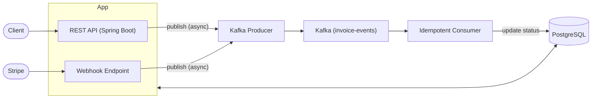

# Orbitly Billing Platform

[](https://github.com/Rajadi16/orbitly-billing-platform/actions/workflows/ci.yml)

Event-driven SaaS billing backend built with **Spring Boot 3**, **Kafka**, **JWT auth**, and **Stripe** (test mode).

## Architecture



Orbitly exposes a secured REST API (JWT Bearer tokens) that accepts Stripe webhook events, publishes them as `invoice-events` messages on a Kafka topic, and processes them via an idempotent Kafka consumer that persists state to PostgreSQL — all services run in Docker with no local JDK or Kafka installation required.

## Stack

| Layer | Technology |
|---|---|
| Runtime | Java 21 (inside Docker) |
| Framework | Spring Boot 3.3 |
| Auth | Spring Security + JJWT |
| Messaging | Apache Kafka 3.7 (KRaft, no Zookeeper) |
| Payments | Stripe Java SDK (test mode) |
| Database | PostgreSQL 16 |
| Migrations | Flyway |
| Build | Maven (multi-stage Docker build) |
| API Docs | OpenAPI / Swagger UI |

## Local Setup

### Prerequisites
- Docker Desktop (that's it — no Java or Kafka needed locally)

### Steps

```bash
# 1. Clone
git clone https://github.com/Rajadi16/orbitly-billing-platform.git
cd orbitly-billing-platform

# 2. Configure secrets
cp .env.example .env
# Edit .env — fill in JWT_SECRET, STRIPE_API_KEY, STRIPE_WEBHOOK_SECRET

# 3. Start everything (postgres + kafka + app)
docker compose up --build

# App is live at http://localhost:8080
# API Docs are live at http://localhost:8080/swagger-ui.html
```

### Useful commands

```bash
# Rebuild only the app after code changes
docker compose up --build app

# Tail logs
docker compose logs -f app

# Tear down (keeps volumes)
docker compose down

# Tear down + wipe volumes
docker compose down -v
```

## Current Scope / MVP Limitations

This project is built as a single-tenant MVP demonstrating event-driven patterns. Current limitations:

- **Single-Tenant Only**: Currently built for a single tenant context. Multi-tenant RBAC is not yet implemented.
- **Dead-Letter Queue (DLQ) Alerting**: Failed messages routed to the `invoice-events-dlq` topic are simply logged by the `DlqConsumer`. In a production environment, this should integrate with PagerDuty/Slack and persist to a `dead_letter_events` table for manual replay.
- **Email/Notifications**: DRAFT to PENDING invoice transitions currently only publish a Kafka event and do not trigger a real email.
- **Stripe Integration**: Runs entirely in test mode. Webhook handler processes `payment_intent.succeeded` and `payment_intent.payment_failed` only.
- **Local Testing (Windows)**: Integration tests using Testcontainers require Docker on Linux/WSL2. They don't run reliably on native Windows Docker Desktop due to a known Testcontainers API compatibility issue, but pass in CI (Ubuntu).
